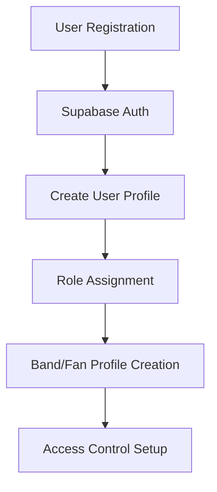
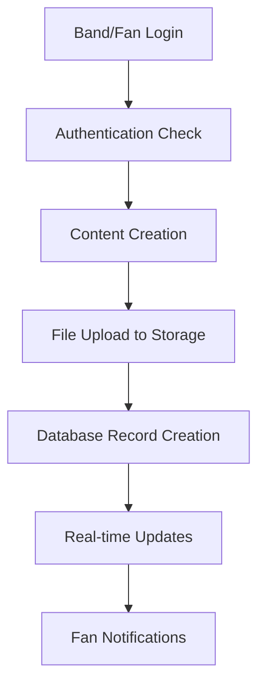
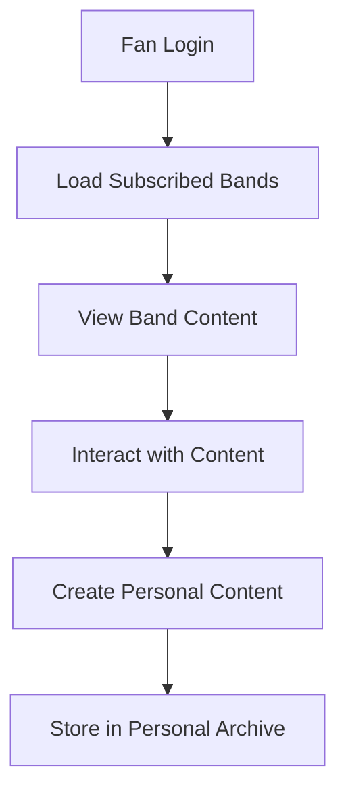
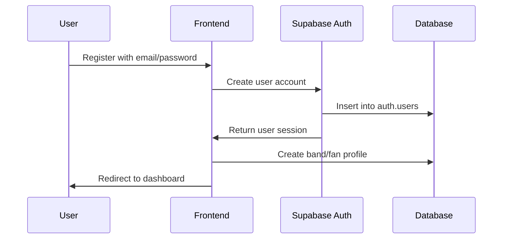
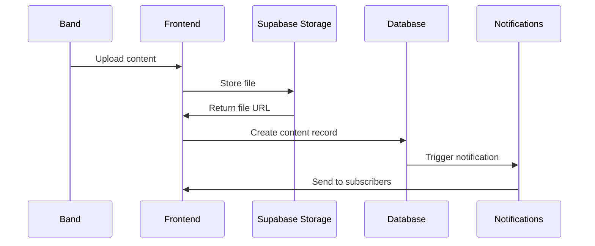
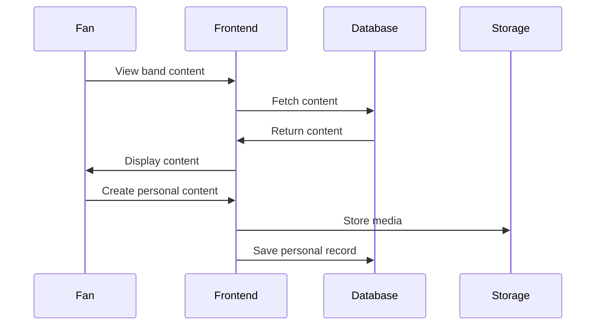
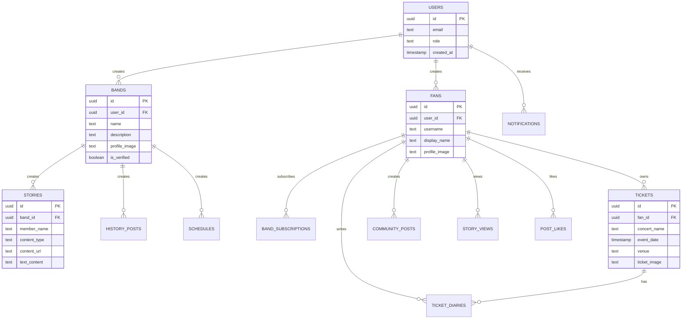

# Indieverse Database Schema & Data Flow Design

## 📊 Overview

This document defines the comprehensive database schema and data flow for the Indieverse platform, designed to support indie bands and their fans with integrated communication and memory preservation features.

## 🔄 Data Flow Architecture

### 1. User Authentication Flow



### 2. Content Creation Flow



### 3. Fan Interaction Flow



## 🗄️ Database Schema Design

### Core Tables

#### 1. Users (auth.users - Supabase Built-in)
```sql
-- Managed by Supabase Auth
CREATE TABLE auth.users (
    id UUID PRIMARY KEY DEFAULT gen_random_uuid(),
    email TEXT UNIQUE NOT NULL,
    encrypted_password TEXT,
    email_confirmed_at TIMESTAMP WITH TIME ZONE,
    created_at TIMESTAMP WITH TIME ZONE DEFAULT NOW(),
    updated_at TIMESTAMP WITH TIME ZONE DEFAULT NOW(),
    role TEXT CHECK (role IN ('band', 'fan')) NOT NULL,
    is_active BOOLEAN DEFAULT TRUE
);

-- Enable RLS
ALTER TABLE auth.users ENABLE ROW LEVEL SECURITY;

-- Policies
CREATE POLICY "Users can view their own profile" ON auth.users
    FOR SELECT USING (auth.uid() = id);

CREATE POLICY "Users can update their own profile" ON auth.users
    FOR UPDATE USING (auth.uid() = id);
```

#### 2. Bands
```sql
CREATE TABLE bands (
    id UUID PRIMARY KEY DEFAULT gen_random_uuid(),
    user_id UUID REFERENCES auth.users(id) ON DELETE CASCADE NOT NULL,
    name TEXT NOT NULL,
    description TEXT,
    profile_image TEXT, -- Storage URL
    banner_image TEXT, -- Storage URL
    genre TEXT,
    location TEXT,
    website_url TEXT,
    social_links JSONB, -- {instagram: "", twitter: "", youtube: ""}
    is_verified BOOLEAN DEFAULT FALSE,
    subscription_price DECIMAL(10,2) DEFAULT 0.00,
    created_at TIMESTAMP WITH TIME ZONE DEFAULT NOW(),
    updated_at TIMESTAMP WITH TIME ZONE DEFAULT NOW(),
    
    CONSTRAINT unique_band_name UNIQUE (name),
    CONSTRAINT valid_website_url CHECK (website_url IS NULL OR website_url ~ '^https?://')
);

-- Indexes
CREATE INDEX idx_bands_user_id ON bands(user_id);
CREATE INDEX idx_bands_name ON bands(name);
CREATE INDEX idx_bands_created_at ON bands(created_at);

-- Enable RLS
ALTER TABLE bands ENABLE ROW LEVEL SECURITY;

-- Policies
CREATE POLICY "Anyone can view bands" ON bands
    FOR SELECT USING (true);

CREATE POLICY "Users can create their own band" ON bands
    FOR INSERT WITH CHECK (auth.uid() = user_id);

CREATE POLICY "Band owners can update their band" ON bands
    FOR UPDATE USING (auth.uid() = user_id);

CREATE POLICY "Band owners can delete their band" ON bands
    FOR DELETE USING (auth.uid() = user_id);
```

#### 3. Fans
```sql
CREATE TABLE fans (
    id UUID PRIMARY KEY DEFAULT gen_random_uuid(),
    user_id UUID REFERENCES auth.users(id) ON DELETE CASCADE NOT NULL,
    username TEXT UNIQUE NOT NULL,
    display_name TEXT,
    profile_image TEXT, -- Storage URL
    bio TEXT,
    location TEXT,
    birth_date DATE,
    preferences JSONB, -- {notifications: true, privacy: "public"}
    created_at TIMESTAMP WITH TIME ZONE DEFAULT NOW(),
    updated_at TIMESTAMP WITH TIME ZONE DEFAULT NOW(),
    
    CONSTRAINT unique_username UNIQUE (username),
    CONSTRAINT valid_username CHECK (username ~ '^[a-zA-Z0-9_]{3,20}$')
);

-- Indexes
CREATE INDEX idx_fans_user_id ON fans(user_id);
CREATE INDEX idx_fans_username ON fans(username);

-- Enable RLS
ALTER TABLE fans ENABLE ROW LEVEL SECURITY;

-- Policies
CREATE POLICY "Fans can view other fans" ON fans
    FOR SELECT USING (true);

CREATE POLICY "Users can create their own fan profile" ON fans
    FOR INSERT WITH CHECK (auth.uid() = user_id);

CREATE POLICY "Fans can update their own profile" ON fans
    FOR UPDATE USING (auth.uid() = user_id);

CREATE POLICY "Fans can delete their own profile" ON fans
    FOR DELETE USING (auth.uid() = user_id);
```

#### 4. Band Subscriptions
```sql
CREATE TABLE band_subscriptions (
    id UUID PRIMARY KEY DEFAULT gen_random_uuid(),
    fan_id UUID REFERENCES fans(id) ON DELETE CASCADE NOT NULL,
    band_id UUID REFERENCES bands(id) ON DELETE CASCADE NOT NULL,
    subscription_type TEXT CHECK (subscription_type IN ('free', 'premium')) DEFAULT 'free',
    subscription_date TIMESTAMP WITH TIME ZONE DEFAULT NOW(),
    expires_at TIMESTAMP WITH TIME ZONE,
    is_active BOOLEAN DEFAULT TRUE,
    payment_status TEXT CHECK (payment_status IN ('pending', 'completed', 'failed', 'cancelled')) DEFAULT 'completed',
    created_at TIMESTAMP WITH TIME ZONE DEFAULT NOW(),
    updated_at TIMESTAMP WITH TIME ZONE DEFAULT NOW(),
    
    CONSTRAINT unique_fan_band_subscription UNIQUE (fan_id, band_id)
);

-- Indexes
CREATE INDEX idx_band_subscriptions_fan_id ON band_subscriptions(fan_id);
CREATE INDEX idx_band_subscriptions_band_id ON band_subscriptions(band_id);
CREATE INDEX idx_band_subscriptions_active ON band_subscriptions(is_active);

-- Enable RLS
ALTER TABLE band_subscriptions ENABLE ROW LEVEL SECURITY;

-- Policies
CREATE POLICY "Fans can view their own subscriptions" ON band_subscriptions
    FOR SELECT USING (auth.uid() IN (
        SELECT user_id FROM fans WHERE id = fan_id
    ));

CREATE POLICY "Bands can view their subscribers" ON band_subscriptions
    FOR SELECT USING (auth.uid() IN (
        SELECT user_id FROM bands WHERE id = band_id
    ));

CREATE POLICY "Fans can create their own subscriptions" ON band_subscriptions
    FOR INSERT WITH CHECK (auth.uid() IN (
        SELECT user_id FROM fans WHERE id = fan_id
    ));

CREATE POLICY "Fans can update their own subscriptions" ON band_subscriptions
    FOR UPDATE USING (auth.uid() IN (
        SELECT user_id FROM fans WHERE id = fan_id
    ));
```

### Content Tables

#### 5. Stories
```sql
CREATE TABLE stories (
    id UUID PRIMARY KEY DEFAULT gen_random_uuid(),
    band_id UUID REFERENCES bands(id) ON DELETE CASCADE NOT NULL,
    member_name TEXT NOT NULL,
    content_type TEXT CHECK (content_type IN ('image', 'video', 'text')) NOT NULL,
    content_url TEXT, -- Storage URL (for image/video)
    text_content TEXT, -- For text stories
    duration INTEGER, -- Duration in seconds for videos
    is_archived BOOLEAN DEFAULT FALSE,
    archive_date TIMESTAMP WITH TIME ZONE,
    view_count INTEGER DEFAULT 0,
    created_at TIMESTAMP WITH TIME ZONE DEFAULT NOW(),
    updated_at TIMESTAMP WITH TIME ZONE DEFAULT NOW(),
    
    CONSTRAINT valid_content CHECK (
        (content_type = 'text' AND text_content IS NOT NULL) OR
        (content_type IN ('image', 'video') AND content_url IS NOT NULL)
    )
);

-- Indexes
CREATE INDEX idx_stories_band_id ON stories(band_id);
CREATE INDEX idx_stories_created_at ON stories(created_at);
CREATE INDEX idx_stories_archived ON stories(is_archived);

-- Enable RLS
ALTER TABLE stories ENABLE ROW LEVEL SECURITY;

-- Policies
CREATE POLICY "Anyone can view stories" ON stories
    FOR SELECT USING (true);

CREATE POLICY "Band members can create stories" ON stories
    FOR INSERT WITH CHECK (auth.uid() IN (
        SELECT user_id FROM bands WHERE id = band_id
    ));

CREATE POLICY "Band members can update stories" ON stories
    FOR UPDATE USING (auth.uid() IN (
        SELECT user_id FROM bands WHERE id = band_id
    ));

CREATE POLICY "Band members can delete stories" ON stories
    FOR DELETE USING (auth.uid() IN (
        SELECT user_id FROM bands WHERE id = band_id
    ));
```

#### 6. History Posts
```sql
CREATE TABLE history_posts (
    id UUID PRIMARY KEY DEFAULT gen_random_uuid(),
    band_id UUID REFERENCES bands(id) ON DELETE CASCADE NOT NULL,
    title TEXT NOT NULL,
    content TEXT NOT NULL,
    image_url TEXT, -- Storage URL
    post_type TEXT CHECK (post_type IN ('milestone', 'announcement', 'update', 'memory')) DEFAULT 'update',
    is_pinned BOOLEAN DEFAULT FALSE,
    view_count INTEGER DEFAULT 0,
    created_at TIMESTAMP WITH TIME ZONE DEFAULT NOW(),
    updated_at TIMESTAMP WITH TIME ZONE DEFAULT NOW()
);

-- Indexes
CREATE INDEX idx_history_posts_band_id ON history_posts(band_id);
CREATE INDEX idx_history_posts_created_at ON history_posts(created_at);
CREATE INDEX idx_history_posts_type ON history_posts(post_type);

-- Enable RLS
ALTER TABLE history_posts ENABLE ROW LEVEL SECURITY;

-- Policies
CREATE POLICY "Anyone can view history posts" ON history_posts
    FOR SELECT USING (true);

CREATE POLICY "Band members can create history posts" ON history_posts
    FOR INSERT WITH CHECK (auth.uid() IN (
        SELECT user_id FROM bands WHERE id = band_id
    ));

CREATE POLICY "Band members can update history posts" ON history_posts
    FOR UPDATE USING (auth.uid() IN (
        SELECT user_id FROM bands WHERE id = band_id
    ));

CREATE POLICY "Band members can delete history posts" ON history_posts
    FOR DELETE USING (auth.uid() IN (
        SELECT user_id FROM bands WHERE id = band_id
    ));
```

#### 7. Schedules
```sql
CREATE TABLE schedules (
    id UUID PRIMARY KEY DEFAULT gen_random_uuid(),
    band_id UUID REFERENCES bands(id) ON DELETE CASCADE NOT NULL,
    title TEXT NOT NULL,
    description TEXT,
    event_date TIMESTAMP WITH TIME ZONE NOT NULL,
    end_date TIMESTAMP WITH TIME ZONE,
    location TEXT,
    venue_name TEXT,
    venue_address TEXT,
    booking_url TEXT,
    ticket_price DECIMAL(10,2),
    event_type TEXT CHECK (event_type IN ('concert', 'fan_meeting', 'broadcast', 'release', 'other')) DEFAULT 'concert',
    status TEXT CHECK (status IN ('scheduled', 'confirmed', 'cancelled', 'completed')) DEFAULT 'scheduled',
    is_featured BOOLEAN DEFAULT FALSE,
    created_at TIMESTAMP WITH TIME ZONE DEFAULT NOW(),
    updated_at TIMESTAMP WITH TIME ZONE DEFAULT NOW(),
    
    CONSTRAINT valid_event_dates CHECK (end_date IS NULL OR end_date >= event_date),
    CONSTRAINT valid_booking_url CHECK (booking_url IS NULL OR booking_url ~ '^https?://')
);

-- Indexes
CREATE INDEX idx_schedules_band_id ON schedules(band_id);
CREATE INDEX idx_schedules_event_date ON schedules(event_date);
CREATE INDEX idx_schedules_status ON schedules(status);
CREATE INDEX idx_schedules_type ON schedules(event_type);

-- Enable RLS
ALTER TABLE schedules ENABLE ROW LEVEL SECURITY;

-- Policies
CREATE POLICY "Anyone can view schedules" ON schedules
    FOR SELECT USING (true);

CREATE POLICY "Band members can create schedules" ON schedules
    FOR INSERT WITH CHECK (auth.uid() IN (
        SELECT user_id FROM bands WHERE id = band_id
    ));

CREATE POLICY "Band members can update schedules" ON schedules
    FOR UPDATE USING (auth.uid() IN (
        SELECT user_id FROM bands WHERE id = band_id
    ));

CREATE POLICY "Band members can delete schedules" ON schedules
    FOR DELETE USING (auth.uid() IN (
        SELECT user_id FROM bands WHERE id = band_id
    ));
```

### Fan Content Tables

#### 8. Tickets
```sql
CREATE TABLE tickets (
    id UUID PRIMARY KEY DEFAULT gen_random_uuid(),
    fan_id UUID REFERENCES fans(id) ON DELETE CASCADE NOT NULL,
    concert_name TEXT NOT NULL,
    event_date TIMESTAMP WITH TIME ZONE NOT NULL,
    venue TEXT NOT NULL,
    ticket_image TEXT, -- Storage URL
    ticket_type TEXT CHECK (ticket_type IN ('physical', 'digital', 'photo')) DEFAULT 'digital',
    seat_info TEXT,
    price DECIMAL(10,2),
    notes TEXT,
    is_favorite BOOLEAN DEFAULT FALSE,
    created_at TIMESTAMP WITH TIME ZONE DEFAULT NOW(),
    updated_at TIMESTAMP WITH TIME ZONE DEFAULT NOW()
);

-- Indexes
CREATE INDEX idx_tickets_fan_id ON tickets(fan_id);
CREATE INDEX idx_tickets_event_date ON tickets(event_date);
CREATE INDEX idx_tickets_concert_name ON tickets(concert_name);

-- Enable RLS
ALTER TABLE tickets ENABLE ROW LEVEL SECURITY;

-- Policies
CREATE POLICY "Fans can view their own tickets" ON tickets
    FOR SELECT USING (auth.uid() IN (
        SELECT user_id FROM fans WHERE id = fan_id
    ));

CREATE POLICY "Fans can create their own tickets" ON tickets
    FOR INSERT WITH CHECK (auth.uid() IN (
        SELECT user_id FROM fans WHERE id = fan_id
    ));

CREATE POLICY "Fans can update their own tickets" ON tickets
    FOR UPDATE USING (auth.uid() IN (
        SELECT user_id FROM fans WHERE id = fan_id
    ));

CREATE POLICY "Fans can delete their own tickets" ON tickets
    FOR DELETE USING (auth.uid() IN (
        SELECT user_id FROM fans WHERE id = fan_id
    ));
```

#### 9. Ticket Diaries
```sql
CREATE TABLE ticket_diaries (
    id UUID PRIMARY KEY DEFAULT gen_random_uuid(),
    ticket_id UUID REFERENCES tickets(id) ON DELETE CASCADE NOT NULL,
    title TEXT,
    content TEXT NOT NULL,
    mood TEXT CHECK (mood IN ('excited', 'happy', 'neutral', 'disappointed', 'amazed')) DEFAULT 'happy',
    media_urls TEXT[], -- Array of storage URLs
    is_private BOOLEAN DEFAULT TRUE,
    created_at TIMESTAMP WITH TIME ZONE DEFAULT NOW(),
    updated_at TIMESTAMP WITH TIME ZONE DEFAULT NOW()
);

-- Indexes
CREATE INDEX idx_ticket_diaries_ticket_id ON ticket_diaries(ticket_id);
CREATE INDEX idx_ticket_diaries_created_at ON ticket_diaries(created_at);

-- Enable RLS
ALTER TABLE ticket_diaries ENABLE ROW LEVEL SECURITY;

-- Policies
CREATE POLICY "Fans can view their own ticket diaries" ON ticket_diaries
    FOR SELECT USING (auth.uid() IN (
        SELECT f.user_id FROM fans f
        JOIN tickets t ON f.id = t.fan_id
        WHERE t.id = ticket_id
    ));

CREATE POLICY "Fans can create their own ticket diaries" ON ticket_diaries
    FOR INSERT WITH CHECK (auth.uid() IN (
        SELECT f.user_id FROM fans f
        JOIN tickets t ON f.id = t.fan_id
        WHERE t.id = ticket_id
    ));

CREATE POLICY "Fans can update their own ticket diaries" ON ticket_diaries
    FOR UPDATE USING (auth.uid() IN (
        SELECT f.user_id FROM fans f
        JOIN tickets t ON f.id = t.fan_id
        WHERE t.id = ticket_id
    ));

CREATE POLICY "Fans can delete their own ticket diaries" ON ticket_diaries
    FOR DELETE USING (auth.uid() IN (
        SELECT f.user_id FROM fans f
        JOIN tickets t ON f.id = t.fan_id
        WHERE t.id = ticket_id
    ));
```

#### 10. Community Posts
```sql
CREATE TABLE community_posts (
    id UUID PRIMARY KEY DEFAULT gen_random_uuid(),
    fan_id UUID REFERENCES fans(id) ON DELETE CASCADE NOT NULL,
    category TEXT CHECK (category IN ('show_off', 'share', 'info', 'question')) NOT NULL,
    title TEXT NOT NULL,
    content TEXT NOT NULL,
    template_type TEXT CHECK (template_type IN ('photocard', 'badge', 'sticker', 'other')),
    design_image TEXT, -- Storage URL
    is_anonymous BOOLEAN DEFAULT FALSE,
    view_count INTEGER DEFAULT 0,
    like_count INTEGER DEFAULT 0,
    created_at TIMESTAMP WITH TIME ZONE DEFAULT NOW(),
    updated_at TIMESTAMP WITH TIME ZONE DEFAULT NOW()
);

-- Indexes
CREATE INDEX idx_community_posts_fan_id ON community_posts(fan_id);
CREATE INDEX idx_community_posts_category ON community_posts(category);
CREATE INDEX idx_community_posts_created_at ON community_posts(created_at);

-- Enable RLS
ALTER TABLE community_posts ENABLE ROW LEVEL SECURITY;

-- Policies
CREATE POLICY "Anyone can view community posts" ON community_posts
    FOR SELECT USING (true);

CREATE POLICY "Fans can create community posts" ON community_posts
    FOR INSERT WITH CHECK (auth.uid() IN (
        SELECT user_id FROM fans WHERE id = fan_id
    ));

CREATE POLICY "Fans can update their own community posts" ON community_posts
    FOR UPDATE USING (auth.uid() IN (
        SELECT user_id FROM fans WHERE id = fan_id
    ));

CREATE POLICY "Fans can delete their own community posts" ON community_posts
    FOR DELETE USING (auth.uid() IN (
        SELECT user_id FROM fans WHERE id = fan_id
    ));
```

### Interaction Tables

#### 11. Story Views
```sql
CREATE TABLE story_views (
    id UUID PRIMARY KEY DEFAULT gen_random_uuid(),
    story_id UUID REFERENCES stories(id) ON DELETE CASCADE NOT NULL,
    fan_id UUID REFERENCES fans(id) ON DELETE CASCADE NOT NULL,
    viewed_at TIMESTAMP WITH TIME ZONE DEFAULT NOW(),
    
    CONSTRAINT unique_story_fan_view UNIQUE (story_id, fan_id)
);

-- Indexes
CREATE INDEX idx_story_views_story_id ON story_views(story_id);
CREATE INDEX idx_story_views_fan_id ON story_views(fan_id);

-- Enable RLS
ALTER TABLE story_views ENABLE ROW LEVEL SECURITY;

-- Policies
CREATE POLICY "Fans can view their own story views" ON story_views
    FOR SELECT USING (auth.uid() IN (
        SELECT user_id FROM fans WHERE id = fan_id
    ));

CREATE POLICY "Fans can create story views" ON story_views
    FOR INSERT WITH CHECK (auth.uid() IN (
        SELECT user_id FROM fans WHERE id = fan_id
    ));
```

#### 12. Post Likes
```sql
CREATE TABLE post_likes (
    id UUID PRIMARY KEY DEFAULT gen_random_uuid(),
    post_id UUID NOT NULL,
    post_type TEXT CHECK (post_type IN ('history_post', 'community_post')) NOT NULL,
    fan_id UUID REFERENCES fans(id) ON DELETE CASCADE NOT NULL,
    created_at TIMESTAMP WITH TIME ZONE DEFAULT NOW(),
    
    CONSTRAINT unique_post_like UNIQUE (post_id, post_type, fan_id)
);

-- Indexes
CREATE INDEX idx_post_likes_post_id ON post_likes(post_id);
CREATE INDEX idx_post_likes_fan_id ON post_likes(fan_id);

-- Enable RLS
ALTER TABLE post_likes ENABLE ROW LEVEL SECURITY;

-- Policies
CREATE POLICY "Anyone can view post likes" ON post_likes
    FOR SELECT USING (true);

CREATE POLICY "Fans can create post likes" ON post_likes
    FOR INSERT WITH CHECK (auth.uid() IN (
        SELECT user_id FROM fans WHERE id = fan_id
    ));

CREATE POLICY "Fans can delete their own post likes" ON post_likes
    FOR DELETE USING (auth.uid() IN (
        SELECT user_id FROM fans WHERE id = fan_id
    ));
```

### Notification Tables

#### 13. Notifications
```sql
CREATE TABLE notifications (
    id UUID PRIMARY KEY DEFAULT gen_random_uuid(),
    user_id UUID REFERENCES auth.users(id) ON DELETE CASCADE NOT NULL,
    title TEXT NOT NULL,
    message TEXT NOT NULL,
    notification_type TEXT CHECK (notification_type IN ('story', 'schedule', 'system', 'subscription')) NOT NULL,
    reference_id UUID, -- ID of the related content
    reference_type TEXT, -- Type of the related content
    is_read BOOLEAN DEFAULT FALSE,
    read_at TIMESTAMP WITH TIME ZONE,
    created_at TIMESTAMP WITH TIME ZONE DEFAULT NOW()
);

-- Indexes
CREATE INDEX idx_notifications_user_id ON notifications(user_id);
CREATE INDEX idx_notifications_is_read ON notifications(is_read);
CREATE INDEX idx_notifications_created_at ON notifications(created_at);

-- Enable RLS
ALTER TABLE notifications ENABLE ROW LEVEL SECURITY;

-- Policies
CREATE POLICY "Users can view their own notifications" ON notifications
    FOR SELECT USING (auth.uid() = user_id);

CREATE POLICY "Users can update their own notifications" ON notifications
    FOR UPDATE USING (auth.uid() = user_id);
```

## 🔄 Data Flow Diagrams

### 1. User Registration Flow


### 2. Content Creation Flow


### 3. Fan Interaction Flow


## 📊 Database Relationships

### Entity Relationship Diagram


## 🔒 Security Considerations

### 1. Row Level Security (RLS)
- All tables have RLS enabled
- Policies ensure users can only access their own data
- Bands can view their subscribers but not personal fan data
- Fans can view public band content but not private band data

### 2. Data Validation
- Check constraints on critical fields
- Proper foreign key relationships
- Input validation at application level with Zod schemas

### 3. File Storage Security
- Secure file upload with size and type restrictions
- Private file access through signed URLs
- Automatic cleanup of orphaned files

## 📈 Performance Optimizations

### 1. Indexing Strategy
- Primary keys on all tables
- Foreign key indexes for join performance
- Composite indexes for common query patterns
- Partial indexes for filtered queries

### 2. Query Optimization
- Use React Query for caching and background updates
- Implement pagination for large datasets
- Optimize image loading with Next.js Image component
- Use database views for complex aggregations

### 3. Storage Optimization
- Image compression and resizing
- Video optimization for mobile devices
- CDN integration for global content delivery
- Automatic cleanup of temporary files

## 🚀 Migration Strategy

### Phase 1: Core Tables
1. Users and authentication
2. Bands and fans profiles
3. Basic content tables (stories, history posts)

### Phase 2: Fan Features
1. Band subscriptions
2. Tickets and diaries
3. Community posts

### Phase 3: Interactions
1. Story views and post likes
2. Notifications system
3. Advanced features

## 📋 Implementation Checklist

- [ ] Set up Supabase project
- [ ] Create all tables with proper constraints
- [ ] Implement RLS policies
- [ ] Set up storage buckets and policies
- [ ] Create database triggers for notifications
- [ ] Implement data validation with Zod
- [ ] Set up monitoring and logging
- [ ] Create backup and recovery procedures
- [ ] Performance testing and optimization
- [ ] Security audit and penetration testing

This comprehensive database schema and data flow design provides a solid foundation for the Indieverse platform, ensuring scalability, security, and performance while supporting all the features outlined in the PRD. 